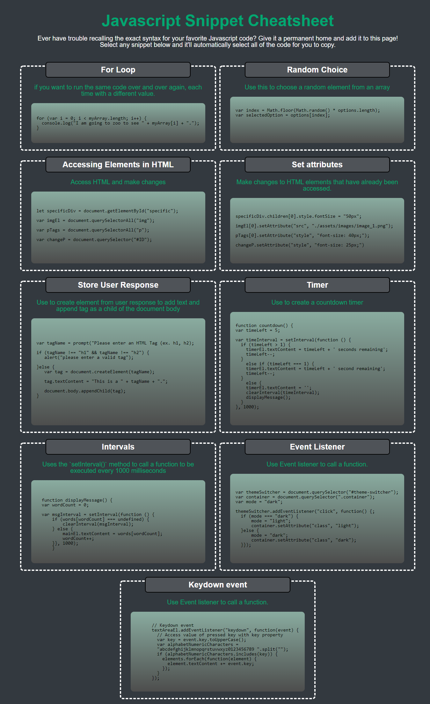

# javascript-cheatsheet

This is a cheatsheet for some code that came in handy when I was first learning javascript.  It is easy to change the content of the cards as needs change.  The cheatsheet is deployed at [kellyjohnson364.github.io/javascript-cheatsheet](https://kellyjohnson364.github.io/javascript-cheatsheet/).  Below is a screenshot of the cheatsheet.

